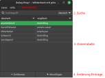

# Wörterbuch mit C und gtk+
Beleg für das Modul Programmierung 1 (I120) bei Prof. Dr.-Ing. Arnold Beck

von Christoph Born

## Aufgabenstellung

**Matrikelnummer:** 53034  
**Aufgabe:** Wörterbuch deu-engl / engl-deu (`(53034 mod 4) + 1 = 3`)  
**Art Bedienoberfläche:** gtk+ (`(53034 mod 3) + 1 = 1`)

### Anforderungen

- Verwaltung von Datensätzen, die Verbindung aus deutschem und englischem Wort speichern

- Operationen mit Datensätzen:
    - Erfassen
    - Löschen
    - Suchen
    - Anzeigen: sortierte tabellarische Auflistung aller Daten  
      (wahlweise nach englischer/deutscher Sortierung)

- Datenspeicherung:
    - programmintern durch geeignete Datenstrukturen  
      (Bereitstellung von Speicherbereichen in der erforderlichen Größe per malloc/free für alle verwalteten Daten, insbesondere für Zeichenketten)

    - in Datei(-en)  
      (beim Verlassen des Programms speichern, sofern sich die Daten beim Programmlauf verändert haben)

- Programm sinnvoll in mindestens 3 C-Module eingeteilt
    - getrennt kompilierbar
    - je ein c- und Headerfile

- Quelltexte sorgsam kommentiert (einschließlich Urheberschaft im Kopf der Quelltexte)

- Kann auf den Rechnern in den Laboren der Fakultät vorgeführt und übersetzt werden

## Implementierung

### Übersicht Dateien

- `beleg-prog1.glade`: Layout-Definition des GTK-GUI, erstellt mit Glade  
  Das Binärimage hängt hiervon ab, bitte stellen Sie diese Datei deshalb zur Ausführung immer im selben Ordner unter diesem Namen bereit.

- `main.*`, `dict.*`, `list.*`: Quelltext-Module  
  (Beschreibung siehe jeweilige Header-Datei)

- `unit_tests/`: Tests für die Module anhand vorgefertigter Szenarien  
  (für die fertige Applikation nicht benötigt)

    - `dicttest*`, `listtest*`: Quellcode, zu erwartende Ausgabe und ggf. weitere benötigte Dateien  
      (`unit_tests/dicttest_assets/*` können Sie als Ausgangspunkt zum Ausprobieren benutzen.)

    - `unit_test.h`: enthält Makros, die in den Tests genutzt werden

### Aufbau Hauptfenster

1. Menüleiste: Enthält Optionen rund um das Öffnen und Speichern von Dateien, sowie Info-Dialog

2. Suche: Bei Eingabe eines Suchbegriffs startet die Suche in den Worten der daneben gewählten Sprache

3. Datentabelle:
    - Sprache der Sortierung kann über Klick auf die Spaltenüberschrift geändert werden
    - Reihenfolge der Spalten kann per Ziehen mit der Maus an den Überschriften geändert werden
    - Bei Bedarf erscheint eine Scrollbar, außerdem lässt sich die Größe des Fensters mit der Maus per Ziehen an der unteren rechten Ecke ändern

4. Änderung Einträge:
    - Bei Klick auf Entfernen wird nach Nachfrage der markierte Eintrag entfernt
    - Bei Klick auf Hinzufügen öffnet sich ein Dialog, über den deutsches und englisches Wort eingetragen werden können

### GUI-Elemente und ihre IDs in Glade

